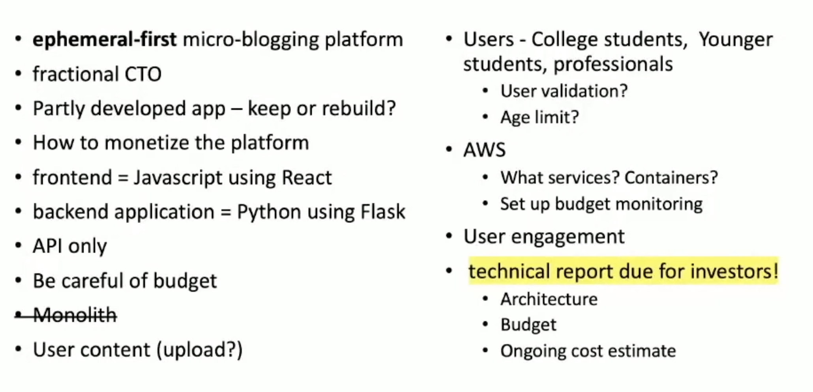
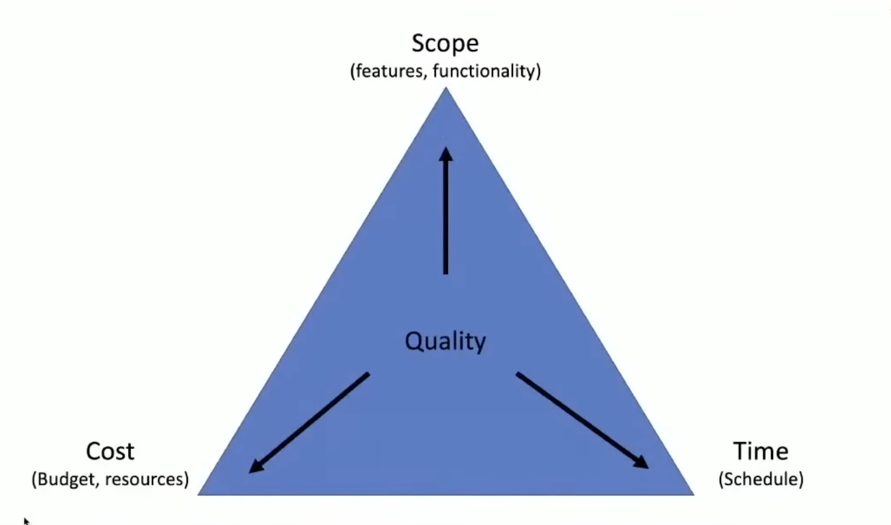

# Introduction

The first step in any project is to fully understand the product we are building. Below is an image that provides a concise overview of the product's core components and design.

Now, let's explore the **Iron Triangle of Project Management**, depicted in the diagram below.

This model illustrates the three key constraints in project management: **budget**, **timeline**, and **scope**. The principle is straightforward—prioritizing two of these factors inevitably impacts the third. For example:

- If you increase the scope and maintain the timeline, costs will rise.
- If you limit the budget and expand the scope, the timeline will stretch.
- If you shorten the timeline without adjusting the scope, quality or costs may be compromised.

Understanding this trade-off helps set realistic expectations and guides decision-making throughout the project. Now, let us dive into this week.

## Table of Contents

1. [Architecting your cloud](./architecting-your-cloud.md)
2. [# Introduction to Amazon Web Services (AWS)](./aws-intro.md)
