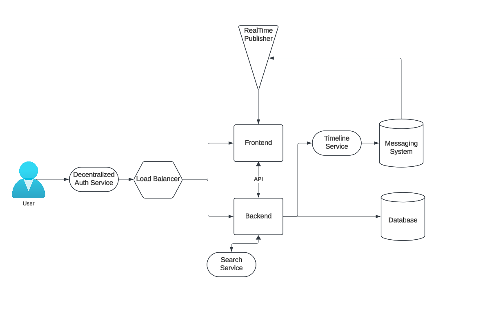

# Architecting the Cloud

## Understanding Good Architecture

Good architecture forms the foundation for successful projects, ensuring they meet objectives while managing risks and constraints effectively.

### Key Elements of Architecture

1. **Requirements**

   Requirements define what the project must achieve. These can be technical (e.g., system uptime, scalability) or business-oriented (e.g., enabling specific user actions, meeting compliance standards). A good requirement must be:

   - **Verifiable**: It can be tested or demonstrated.
   - **Monitorable**: Progress can be tracked during the project lifecycle.
   - **Traceable**: Clearly linked to a business goal or technical need.
   - **Feasible**: Realistic within the project's constraints and resources.

   **Examples of Requirements**:

   - Meeting ISO compliance standards.
   - Adhering to Service Level Agreements (SLAs).
   - Allowing users to complete a specific task, such as submitting an order or generating a report.

2. **Risks**

   Risks are potential issues that could hinder project success if not addressed. Effective architecture includes strategies to mitigate these risks.

   **Common Risks**:

   - **Single Points of Failure (SPoFs)**: Components without redundancy that could disrupt the entire system.
   - **User Commitment**: Low engagement from end users, leading to unmet expectations.
   - **Late Delivery**: Project delays impacting deployment timelines and user adoption.

3. **Assumptions**

   Assumptions are statements taken as true during the planning and implementation phases. These can include factors like expected user behavior, system performance under load, or availability of resources. While necessary for early planning, they must be validated regularly to ensure the project stays on track.

4. **Constraints**

   Constraints are limitations that must be adhered to during the project. These can include policies, budgets, technical restrictions, or regulatory requirements.

   **Examples of Constraints**:

   - Strict compliance with GDPR.
   - Budget caps restricting resource allocation.
   - Limited availability of specific cloud regions.

## RRAC Framework: Requirements, Risks, Assumptions, and Constraints

The RRAC framework ensures a structured approach to addressing critical factors before moving into design. This clarity enables smoother transitions between planning and execution.

## Design Phases

Once RRAC is established, the project moves into design. Design phases include conceptual, logical, and physical representations of the system:

1. **Conceptual Design**

   - High-level design created collaboratively by business stakeholders and architects.
   - Focuses on organizing and defining overarching concepts and rules without implementation details.
   - Often referred to as a "napkin design."

   **Purpose**: Helps align stakeholders on the project's objectives and guiding principles.

2. **Logical Design**

   - Describes how the system should function in an abstract sense.
   - Includes the architecture of components, interactions, and processes, but without specifying exact names or sizes.
   - Example: An undeployed CloudFormation Template (CFT).

   **Purpose**: Provides a blueprint for implementation without locking in specific technologies or configurations.

3. **Physical Design**

   - Details the actual implementation, including resource allocations and configurations.
   - Includes specific elements like IP addresses, EC2 instances, and load balancers.

   **Purpose**: Represents the tangible system as it exists or will be deployed.

## Building a Common Understanding

For successful architecture, it’s crucial to develop a shared vocabulary and understanding among stakeholders.

### Key Strategies

- **Ask Basic Questions**: Even seemingly obvious questions like "Why are we here?" or "What is the goal of this meeting?" can uncover critical gaps.
- **Adopt Perspectives**:
  - Pretend to be the **user**: Consider what happens at each step of their journey.
  - Pretend to be the **packet**: Trace the flow of data through the system to identify potential bottlenecks or failures.
- **Document Everything**: Maintain clear records of decisions, assumptions, and requirements for reference.
- **Use Frameworks**: For example, the **TOGAF framework** provides methods and tools for enterprise architecture. It aligns closely with AWS's [Well-Architected Framework](https://us-east-2.console.aws.amazon.com/wellarchitected/home?region=us-east-2#/).

## The Pillars of a Well-Architected Framework

A robust cloud architecture is built on several key pillars:

1. **Operational Excellence**

   - Focuses on running and monitoring systems to deliver business value.
   - Involves automating changes, responding to events, and defining processes.

2. **Security**

   - Ensures the protection of data, systems, and assets.
   - Key considerations: identity and access management (IAM), data encryption, and compliance.

3. **Reliability**

   - Enables workloads to recover from disruptions and scale to meet demands.
   - Key focus areas: monitoring resources, creating recovery strategies, and implementing fault tolerance.

4. **Performance Efficiency**

   - Ensures optimal use of resources to meet system requirements.
   - Key focus areas: selecting appropriate resource types and sizes, monitoring performance, and testing solutions.

5. **Cost Optimization**

   - Minimizes costs while delivering required performance and reliability.
   - Strategies: right-sizing resources, optimizing licensing, and using managed services.

6. **Sustainability**
   - Reduces the environmental impact of workloads.
   - Includes strategies like consolidating resources, optimizing energy efficiency, and using renewable energy sources.

## Creating an Architecture Diagram

This is a very basic architecture for a full stack app. This was created using [Lucidchart](https://www.googleadservices.com/pagead/aclk?sa=L&ai=DChcSEwj30fzB9aKKAxXmdEcBHYF7LyEYABAAGgJxdQ&co=1&gclid=Cj0KCQiAsOq6BhDuARIsAGQ4-zjMtTJ7Hf3M-tZPAYqQbp8LN6gZzszUDV6E7VgrDcaAlaN-FRsAM_gaAon3EALw_wcB&ohost=www.google.com&cid=CAESVuD2j1ljDxX9t9-_BfFl9YiB9TxprVJGsH7pD5RqgcPKpggjGnJchg91_HLBpb1IUs7NHNC6Zsf8fcpaRA_IDr0T7YTkuuKpJvYjlUreEy9fUVjsc7hu&sig=AOD64_2aHx6McFmWmpOaYuzLP3uwMdJsqQ&q&adurl&ved=2ahUKEwiNufbB9aKKAxULv4kEHbWYN8QQ0Qx6BAgMEAE).

